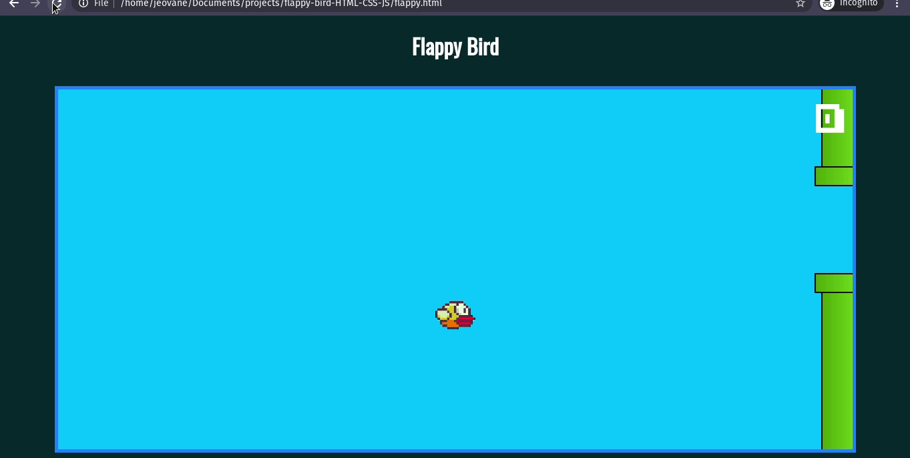

<h1 align="center">Flappy Bird</h1>

<h2 align="center">Será que você consegue?</h2>
<h2 align = "center">


</h2>

## Sumário

- [O jogo]("#jogo")
- [Técnologias e como executar]("#tec-exe")
- [Gameplay]("#gameplay")

<a id="jogo"></a>
## :video_game: O jogo
<p align="justify">
Flappy Bird é um jogo eletrônico para dispositivos móveis de 2013 desenvolvido em Hanói pelo programador vietnamita Nguyễn Hà Đông e publicado pela .GEARS studios. O jogo foi publicado em maio de 2013 para o iPhone 5, e então atualizado para o iOS 7 em setembro de 2013. Em janeiro de 2014, ele ficou no topo da categoria de jogos gratuitos da iTunes App Store chinesa e americana, e mais tarde naquele mês da loja do Reino Unido, onde foi chamado de "o novo Angry Birds". Terminou o mês de janeiro como o aplicativo mais baixado da App Store. Existe uma versão para Windows 8 e Windows 8.1.
 </p>
<a href="https://pt.wikipedia.org/wiki/Flappy_Bird">Wikipedia</a>

<a id="tec-exe"></a>
## :robot: Técnologias e como executar

- O jogo foi construído apenas com HTML5, CSS3 e JavaScript. Não foi usado nenhum framework ou biblíteca durante a construção.

- Para executar basta apenas fazer um clone do repositório e executar o arquivo flappy.html em qualquer navegador.

```sh
    $ git clone https://github.com/jeovane16/flappy-bird-HTML-CSS-JS.git
```
<a id="gameplay"></a>
## :joystick: Gameplay

<h1>
    
</h1>